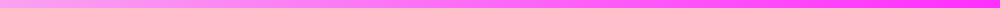

```html
<!DOCTYPE html>
<html lang="en">
<head>
  <meta charset="UTF-8">
  <meta name="viewport" content="width=device-width, initial-scale=1.0">

  <title>Zenomo Studios</title>

  <style>
    * {
      box-sizing: border-box;
    }

    html,
    body {
      margin: 0;
      padding: 0;
      background: transparent;
    }

    .zenomo-header {
      position: relative;
      width: 100%;
      min-height: 420px;
      overflow: hidden;

      display: flex;
      align-items: center;
      justify-content: center;

      font-family:
        Inter,
        -apple-system,
        BlinkMacSystemFont,
        "Segoe UI",
        Roboto,
        Helvetica,
        Arial,
        sans-serif;

      color: #ffffff;
      isolation: isolate;
    }

    /* --------------------------------------------------
       Banner
    -------------------------------------------------- */

    .zenomo-header::before {
      content: "";
      position: absolute;
      inset: 0;

      background:
        linear-gradient(
          180deg,
          rgba(0, 0, 0, 0.25),
          rgba(0, 0, 0, 0.55)
        ),
        url("./asset2/AssetB.webp") center / cover no-repeat;

      z-index: -3;

      transform: scale(1.05);
      animation: bannerZoom 12s ease-in-out infinite alternate;
    }

    /* --------------------------------------------------
       Animated atmospheric glow
    -------------------------------------------------- */

    .zenomo-header::after {
      content: "";
      position: absolute;
      inset: -30%;

      background:
        radial-gradient(
          circle at 20% 50%,
          rgba(255, 255, 255, 0.12),
          transparent 28%
        ),
        radial-gradient(
          circle at 80% 50%,
          rgba(255, 255, 255, 0.10),
          transparent 30%
        );

      z-index: -2;
      pointer-events: none;

      animation: atmosphere 8s ease-in-out infinite alternate;
    }

    /* --------------------------------------------------
       Main content
    -------------------------------------------------- */

    .zenomo-content {
      width: min(1100px, 92%);
      padding: 60px 20px;

      display: flex;
      flex-direction: column;
      align-items: center;
      justify-content: center;

      text-align: center;
    }

    /* --------------------------------------------------
       Custom separators
    -------------------------------------------------- */

    .zenomo-divider {
      width: min(700px, 85%);
      height: auto;

      display: block;

      object-fit: contain;

      opacity: 0;

      filter:
        drop-shadow(0 0 8px rgba(255, 255, 255, 0.35));

      animation:
        dividerReveal 1.2s ease forwards,
        dividerGlow 3s ease-in-out 1.2s infinite alternate;
    }

    .zenomo-divider.top {
      margin-bottom: 30px;
      animation-delay: 0.15s, 1.35s;
    }

    .zenomo-divider.bottom {
      margin-top: 30px;
      animation-delay: 0.75s, 1.95s;
    }

    /* --------------------------------------------------
       Logo
    -------------------------------------------------- */

    .zenomo-logo {
      width: clamp(90px, 13vw, 145px);
      height: clamp(90px, 13vw, 145px);

      object-fit: contain;

      margin-bottom: 24px;

      opacity: 0;
      transform: translateY(18px) scale(0.8);

      filter:
        drop-shadow(0 0 12px rgba(255, 255, 255, 0.35));

      animation:
        logoReveal 1s cubic-bezier(.2,.8,.2,1) 0.35s forwards,
        logoFloat 5s ease-in-out 1.35s infinite;
    }

    /* --------------------------------------------------
       Heading
    -------------------------------------------------- */

    .zenomo-title {
      margin: 0;

      font-size: clamp(2rem, 5vw, 4.5rem);
      line-height: 1.05;
      font-weight: 800;
      letter-spacing: -0.04em;

      text-shadow:
        0 3px 15px rgba(0, 0, 0, 0.45);

      opacity: 0;
      transform: translateY(20px);

      animation:
        titleReveal 1s cubic-bezier(.2,.8,.2,1) 0.65s forwards;
    }

    /* --------------------------------------------------
       Subtitle
    -------------------------------------------------- */

    .zenomo-subtitle {
      margin: 18px 0 0;

      max-width: 650px;

      font-size: clamp(0.85rem, 1.8vw, 1.1rem);
      line-height: 1.6;

      letter-spacing: 0.12em;
      text-transform: uppercase;

      opacity: 0;

      animation:
        subtitleReveal 1s ease 1s forwards;
    }

    /* --------------------------------------------------
       Shimmer across heading
    -------------------------------------------------- */

    .zenomo-title span {
      display: inline-block;

      background:
        linear-gradient(
          110deg,
          #ffffff 20%,
          #ffffff 40%,
          rgba(255,255,255,0.55) 50%,
          #ffffff 60%,
          #ffffff 80%
        );

      background-size: 250% auto;

      -webkit-background-clip: text;
      background-clip: text;

      -webkit-text-fill-color: transparent;

      animation: textShimmer 5s linear 1.8s infinite;
    }

    /* --------------------------------------------------
       Animations
    -------------------------------------------------- */

    @keyframes bannerZoom {
      from {
        transform: scale(1.05);
      }

      to {
        transform: scale(1.12);
      }
    }

    @keyframes atmosphere {
      from {
        transform: translate3d(-2%, 0, 0) scale(1);
        opacity: 0.65;
      }

      to {
        transform: translate3d(2%, -1%, 0) scale(1.08);
        opacity: 1;
      }
    }

    @keyframes dividerReveal {
      from {
        opacity: 0;
        transform: scaleX(0.65);
      }

      to {
        opacity: 1;
        transform: scaleX(1);
      }
    }

    @keyframes dividerGlow {
      from {
        filter:
          drop-shadow(0 0 5px rgba(255,255,255,0.2));
      }

      to {
        filter:
          drop-shadow(0 0 16px rgba(255,255,255,0.55));
      }
    }

    @keyframes logoReveal {
      from {
        opacity: 0;
        transform: translateY(18px) scale(0.8);
      }

      to {
        opacity: 1;
        transform: translateY(0) scale(1);
      }
    }

    @keyframes logoFloat {
      0%,
      100% {
        transform: translateY(0);
      }

      50% {
        transform: translateY(-8px);
      }
    }

    @keyframes titleReveal {
      from {
        opacity: 0;
        transform: translateY(20px);
      }

      to {
        opacity: 1;
        transform: translateY(0);
      }
    }

    @keyframes subtitleReveal {
      from {
        opacity: 0;
        transform: translateY(10px);
      }

      to {
        opacity: 0.8;
        transform: translateY(0);
      }
    }

    @keyframes textShimmer {
      0% {
        background-position: 200% center;
      }

      100% {
        background-position: -50% center;
      }
    }

    /* --------------------------------------------------
       Reduced motion
    -------------------------------------------------- */

    @media (prefers-reduced-motion: reduce) {
      *,
      *::before,
      *::after {
        animation-duration: 0.01ms !important;
        animation-iteration-count: 1 !important;
        scroll-behavior: auto !important;
      }
    }

    /* --------------------------------------------------
       Mobile
    -------------------------------------------------- */

    @media (max-width: 600px) {
      .zenomo-header {
        min-height: 340px;
      }

      .zenomo-content {
        padding: 45px 15px;
      }

      .zenomo-divider {
        width: 90%;
      }

      .zenomo-divider.top {
        margin-bottom: 22px;
      }

      .zenomo-divider.bottom {
        margin-top: 22px;
      }

      .zenomo-subtitle {
        letter-spacing: 0.08em;
      }
    }
  </style>
</head>

<body>

  <header class="zenomo-header">

    <main class="zenomo-content">

      <!-- Custom separator -->
      

      <!-- Company logo -->
      

      <!-- Main title -->
      <h1 class="zenomo-title">
        <span>Welcome to Zenomo Studios</span>
      </h1>

      <!-- Optional subtitle -->
      <p class="zenomo-subtitle">
        Creating • Building • Innovating
      </p>

      <!-- Custom separator -->
      

    </main>

  </header>

</body>
</html>
```
